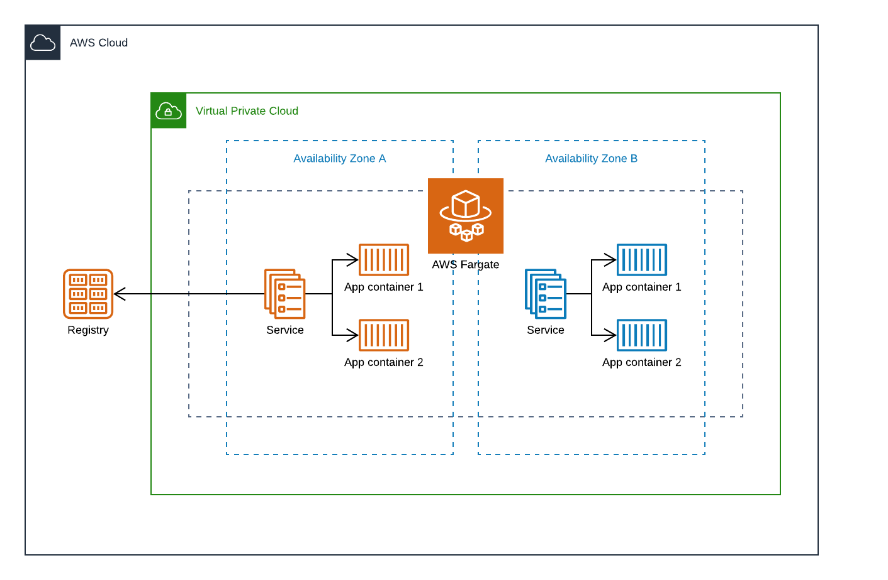
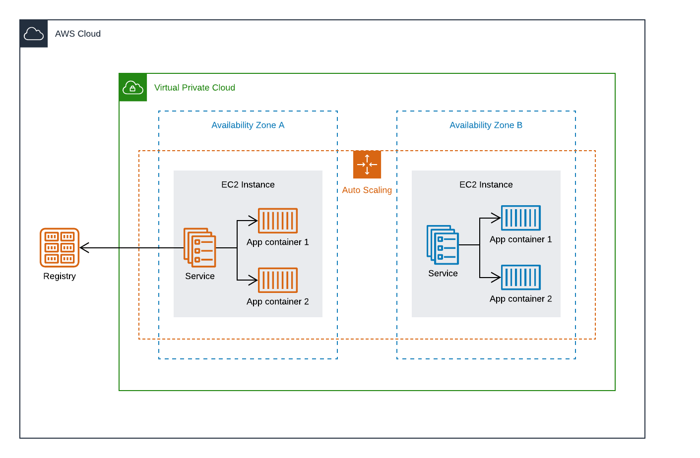
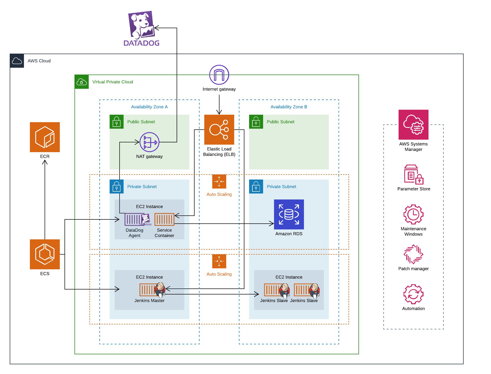

# AWS ECS

Amazon Elastic Container Service (Amazon ECS) is a highly scalable, high-performance container orchestration service that supports Docker containers and allows to easily run and scale containerized applications on AWS. Amazon ECS eliminates the need for you to install and operate your own container orchestration software, manage and scale a cluster of virtual machines, or schedule containers on those virtual machines.

## Fargate
AWS Fargate is a compute engine for Amazon ECS that allows you to run containers without having to manage servers or clusters. With AWS Fargate, you no longer have to provision, configure, and scale clusters of virtual machines to run containers.



## EC2
With ECS running on EC2 instances you are responsible of deploying the required infrastructure. You need to configure and manage the EC2 instances and the scaling policies, but you have more control over your infrastructure.



## EC2 vs Fargate

Choosing one or another depends on the needs of every organization:
- Fargate provides faster development and scaling by leaving the underlaying infrastructure to AWS
- EC2 provides more control over the instances to support compliance and governance requirements, or broader customization options.

# Project

This project contains the templates to spin up a complete environment with for a containerized application running on ECS. It is built using nested stacks with different modules, implementing nCloud best practices. This repo contains the following modules:

- [ECS Infrastructure](ReadMe.md): Infrastructure to run an application on ECS. It includes the *network* (VPC, subnets, ACL's, etc), *database* (RDS), and *ECS infrastructure* (cluster, services) for an application.
- [Containerized Application](application): An application developed using containers, following some Doker best practices
- [CI / CD](continuous-integration): Infrastructure to build a complete *continuous integration / conituous delivery* pipelne (Jenkins master-slave set up using ECS and a Blue / Green deployment implementation)
- [Monitoring](monitoring): External monitoring set up for the ECS application using *DataDog* 
- [Management](management): A management and compliance set up using *SSM* (Maintenance windows, security scans and patches, and an automated AMI patching)



## Getting Started

These instructions will help you to deploy the complete project in AWS using *CloudFormation*

### Prerequisites

To deploy the project it is needed to set up some configuration parameters on *Parameter Store* before deploying the stacks
  - /ECS/DB_USER : The Database username
  - /ECS/DB_PASSWORD : The Database password
  - /ECS/DD_API_KEY : The DataDog Api key to run the agent

you can upload these parameters with the following commands:

```bash
aws ssm put-parameter --name /ECS/DB_USER --type String --value <db_username>
aws ssm put-parameter --name /ECS/DB_PASSWORD --type String --value <db_password>
aws ssm put-parameter --name /ECS/DD_API_KEY --type String --value <dd_api_key>
```

Also you need to upload the templates to an S3 bucket:

```bash
aws s3 sync . "s3://<TemplatesBucketName>/<Prefix>" --exclude "*" --include "*.yml" --include "*.zip"
```

And finally deploy the stack:

```bash
aws cloudformation create-stack --region us-west-2 --stack-name "<StackName>" --template-body file://master.yml --parameters ParameterKey=KeyPair,ParameterValue="<KeyPair>" ParameterKey=QSS3BucketName,ParameterValue="<TemplatesBucketName>" ParameterKey=QSS3KeyPrefix,ParameterValue="<Prefix>"  --capabilities CAPABILITY_NAMED_IAM
```

You can also use the commands scripts included in the *commands* folder by setting the parameters in the **config.yml**:

```bash
./commands/sync.sh
./commands/create.sh
```