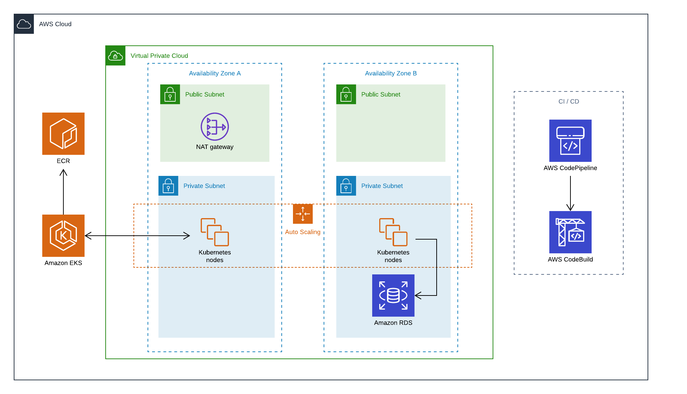

# AWS EKS

Amazon Elastic Container Service for Kubernetes (Amazon EKS) is a managed service that makes it easy for you to run Kubernetes on AWS without needing to stand up or maintain your own Kubernetes control plane. Kubernetes is an open-source system for automating the deployment, scaling, and management of containerized applications.


## Infrastructure

This project contains the templates to spin up a complete EKS environment including the networking (VPC, subnets, etc), the EKS cluster and an RDS for the application. It is built using nested stacks with different modules, implementing nCloud best practices. This repo contains the following modules:

- [EKS Infrastructure](ReadMe.md): Infrastructure to run an application on EKS. It includes the *network* (VPC, subnets, ACL's, etc), *database* (RDS), and *EKS infrastructure* (cluster, Worker nodes) for an application.
- [Containerized Application](application/ReadMe.md): An application developed using containers, following some Doker best practices
- [Kubernetes](kubernetes/ReadMe.md): The architecture of the kubernetes application
- [CI / CD](continuous-integration/ReadMe.md): Infrastructure to build a complete *continuous integration / conituous delivery* pipelne using CodePipeline and CodeBuild
- [Monitoring](monitoring/ReadMe.md): External monitoring set up for the ECS application using *DataDog* 



## Getting Started

These instructions will help you to deploy the complete project in AWS using *CloudFormation*

### Prerequisites

To deploy the project it is needed to set up some configuration parameters on *Parameter Store* before deploying the stacks
  - /EKS/DB_USER : The Database username
  - /EKS/DB_PASSWORD : The Database password
  - /EKS/DD_API_KEY : The DataDog Api key to run the agent
  - /EKS/GitHubToken : The GitHub authentication token

you can upload these parameters with the following commands:

```bash
aws ssm put-parameter --name /EKS/DB_USER --type String --value <db_username>
aws ssm put-parameter --name /EKS/DB_PASSWORD --type String --value <db_password>
aws ssm put-parameter --name /EKS/DD_API_KEY --type String --value <dd_api_key>
aws ssm put-parameter --name /EKS/GitHubToken --type String --value <github_token>
```

Also you need to upload the templates to an S3 bucket:

```bash
aws s3 sync . "s3://<TemplatesBucketName>/<Prefix>" --exclude "*" --include "*.yml" --include "*.zip"
```

And finally deploy the stack:

```bash
aws cloudformation create-stack --region "<Region>" --stack-name "<StackName>" --template-body file://master.yml --parameters ParameterKey=KeyPair,ParameterValue="<KeyPair>" ParameterKey=S3BucketName,ParameterValue="<TemplatesBucketName>" ParameterKey=S3KeyPrefix,ParameterValue="<Prefix>"  --capabilities CAPABILITY_NAMED_IAM
```

You can also use the commands scripts included in the *commands* folder by setting the parameters in the **config.yml**:

```bash
./commands/parameters.sh
./commands/sync.sh
./commands/create.sh
```

### CloudFormation Parameters

| Parameter    | Description                                               | Optional |
|--------------|-----------------------------------------------------------|----------|
| KeyPair      | EC2 KeyPair to use                                        | False    |
| S3BucketName | S3 Bucket for the CF assets                               | False    |
| S3KeyPrefix  | S3 Prefix for the CF assets                               | False    |
| Environment  | A Env name to append to resources name [Dev, Stage, Prod] | True     |