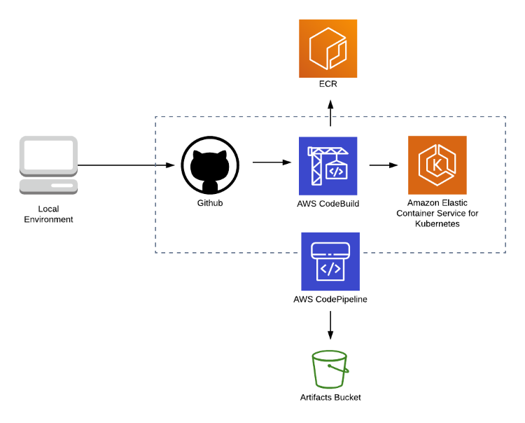

# CI / CD

This module creates the infrastructure for a continuous integration / continuous delivery pipeline using CodePipeline and CodeBuild services from AWS

## CodePipeline

CodePipeline was configured with two stages:

  1. CheckOut Stage: Configured with GitHub as source code management
  2. Depoyment Stage: This stage uses CodeBuild to Test, Build, Push the image to ECR and deploy the new application to EKS

## CodeBuild

CodeBuild uses a **buildspec.yml** file in the application repository for the build steps

### Hadolint

Hadolint is a smart Dockerfile linter that helps you build best practice Docker images. The linter parses the Dockerfile and perform rules on top of it to see if it complies with all the best practices.
You can find more information on the [Hadolint Repo](https://github.com/hadolint/hadolint)

The Dockerfile linting is executed in the *pre_build* phase of the build

### Vulnerability Scanner

A [Vulnerability Scanner](../coreos-clair/ReadMe.md) is used to analyze the images before pushing and deploying the new image. This Enforces security best practices, catches human erros and prevents security breaches on our live environment

The Vulnerability Scanner is executed in the *post_build* phase of the build

## Getting Started

Some steps are required to allow the Pipeline to interact with the EKS cluster

  1. Go to the outputs of the deployment-pipeline Stack and copy the *ARN* of the CodeBuild role
  2. Go to the **aws-auth-cn.yml** file and paste the *ARN* in the builder role

With these steps we are granting permissions to the CodeBuild role to access the EKS cluster by using the *aws-auth* configmap

## CloudFormation Parameters

| Parameter              | Description                                               | Optional |
|------------------------|-----------------------------------------------------------|----------|
| ApplicationName        | Application name used no name resources                   | True     |
| CodeBuildImage         | Image used for CodeBuild environment                      | False    |
| ECRRepositoryName      | S3 Prefix for the CF assets                               | True     |
| GitHubRepositoryName   | TheThe GitHub repository name to use as source code       | True     |
| GitHubRepositoryBranch | The GitHub repository branch to use                       | True     |
| GitHubOwner            | The owner of the repository                               | True     |
| EKSClusterName         | Name of the EKS Cluster to deploy the application         | True     |
| ServiceName            | Name of the service to update                             | True     |
| Environment            | A Env name to append to resources name [Dev, Stage, Prod] | False    |
| StackName              | Stack name to name resources                              | True     |
